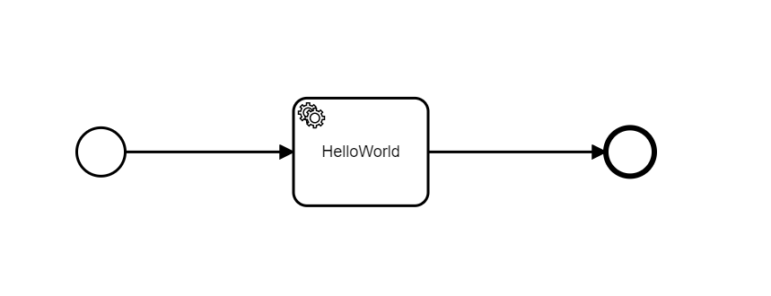
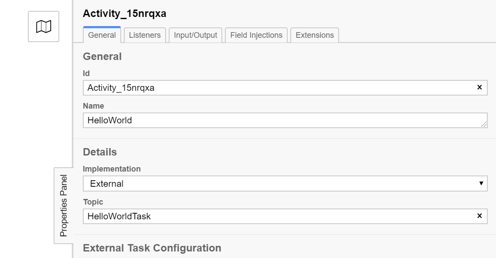

# camunda-external-task-client-python3

!! This is a fork of . It is not compatible with the original code base any longer.!!

This fork makes use of `async/await` and operates workers asynchronously rather than threaded. Additionally, it contains some convenience functions that wrap the Camunda REST API and speed up development.

## Installation

The easiest way to install this client is via `pip`:

```bash
pip install git+https://github.com/OpenAvikom/camunda-external-task-client-python3
```

If you want to run the examples, it might be easier to first clone the project and run everything locally:

```bash
git clone https://github.com/OpenAvikom/camunda-external-task-client-python3.git
cd camunda-external-task-client-python3
```

## Hello World Example

This example will show you how to let a Python client communicate with Camunda.

Firs, we assume that Camunda is up and running. If that's not the case, you might want to have a look at the [Camunda Platform Docker Images](https://github.com/camunda/docker-camunda-bpm-platform).
Second, we assume that Camunda is running at [localhost:8080](localhost:8080). If not, you need to adapt the example below accordingly.
Third, you need a way to deploy and run BPMN-Prozesses. The [Camunda Modeler](https://camunda.com/de/download/modeler/) is probably a good point of departure.

### The Model

The file [`bpmn_processes/hello_world.bpmn`](bpmn_processes/hello_world.bpmn) contains a very simple model:




We have a start event (left circle), a ServiceTask to conduct and an end event (right circle). When you hit the 'Start Current Diagram' (the 'play' button in the modeler) nothing much will happen.
The process will be running though. You can check [localhost:8080](localhost:8080) to make sure.

Not let's have a closer look at the 'Hello World' external task (the square symbol with the cogs at the top right).
The interesting fields in the property panel are `Implementation` and `Topic`:



`Implementation` tells Camunda, that the task should be resolved by an `External` worker and `Topic` is a string that more or less describes the task to be conducted.
We see that Camunda is now waiting for an external worker that is capable of conducting a task with the topic `HelloWorldTask`.
The Camunda Cockpit will show you a running process waiting for `HelloWorld` to be completed by an external process.
Now let's create a Python client which will subscribe to that topic and do tasks by just returning a success event.
The file can be found in [`examples/hello_world.py`](examples/hello_world.py):

```python

import aiohttp
import asyncio

from camunda.external_task.external_task import ExternalTask, TaskResult
from camunda.external_task.external_task_worker import ExternalTaskWorker


async def main():
    # let's create an async http context with aiohttp
    # aiohttp will close the connection when the worker returns (it won't though)
    async with aiohttp.ClientSession() as session:
        # We create a worker with a task id and pass the http session as well as the REST endpoint of Camunda.
        # You need to change 'base_url' in case your Camunda engine is configured differently.
        worker = ExternalTaskWorker(worker_id=1, base_url=f"http://localhost:8080/engine-rest", session=session)
        print("waiting for a task ...")
        # Subscribe is an async function which will block until the worker is cancelled with `worker.cancel()`,
        # In this example, no one will do this. We will stop the program with Ctrl+C instead
        # When the worker detects a new task for the topic assigned to `topic_name` it will trigger the 
        # function/method passed to `action`.
        await worker.subscribe(topic_names="HelloWorldTask", action=process)

# this will be called when a task for the subscribed topic is available
async def process(task: ExternalTask) -> TaskResult:
    print("I got a task!")
    # Right now we just return the result of `task.complete` which is a 
    # `TaskResult` that messages Camunda a successful task execution.
    # If we return `task.fail()` instead, Camunda will publish the task again until
    # some client finally completes it or the maximum amount of retries is reached.
    return task.complete()

# run the main task
asyncio.run(main())
```

You can run that example from the project folder with:

```bash
python examples/hello_world.py
```

You should see something like this in your terminal:

```bash
waiting for a task ...
I got a task!
```

If you don't see the second line you probably need to start the Camunda process (in the modeler).
